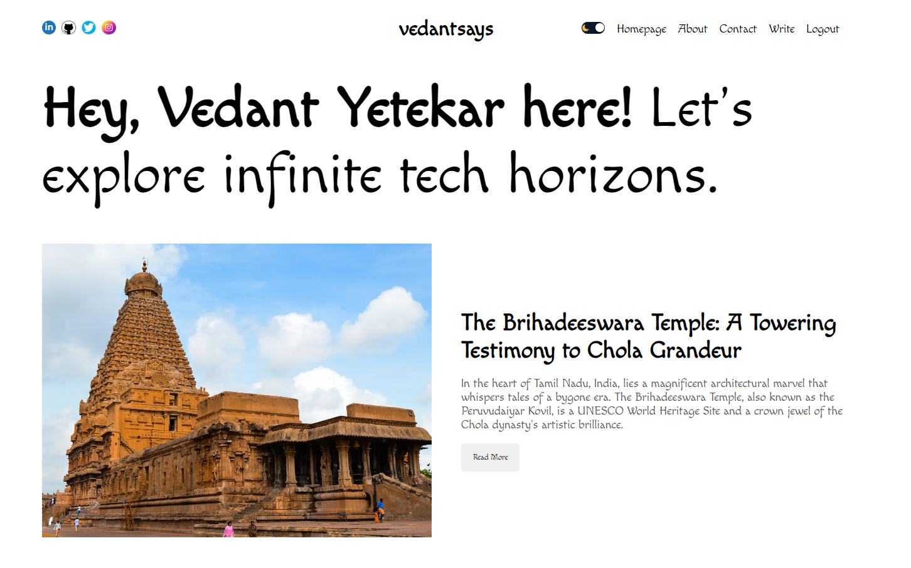
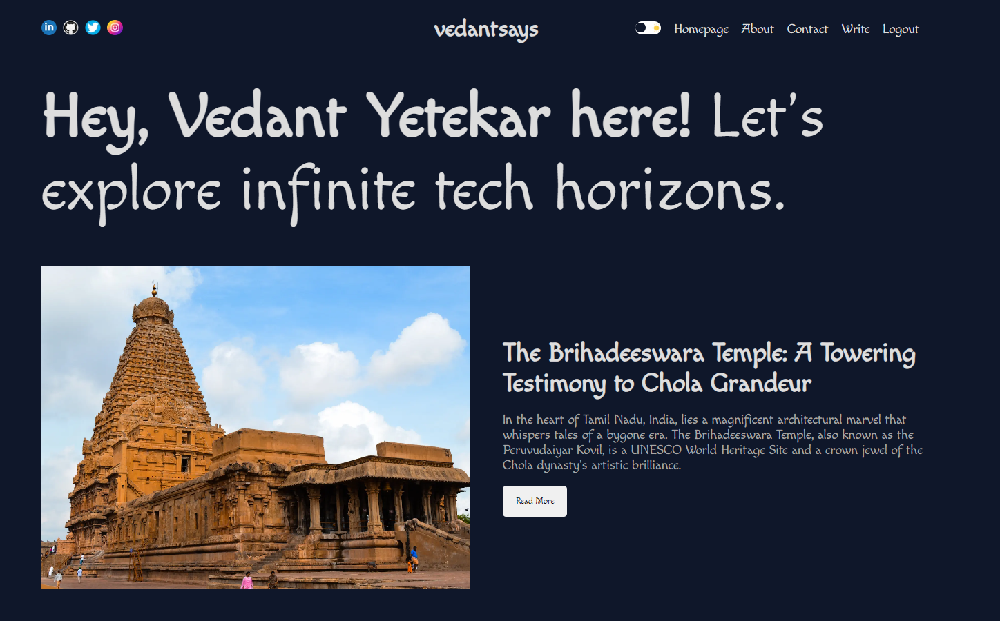
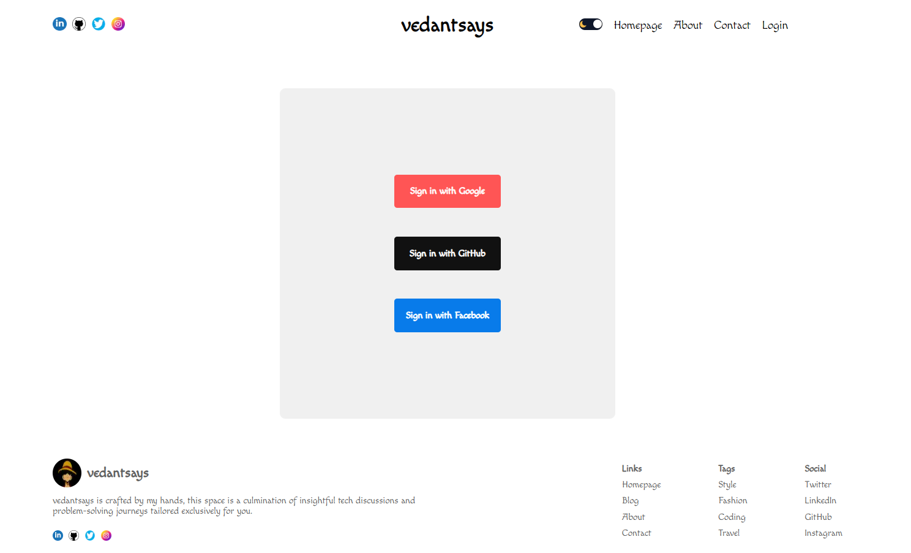
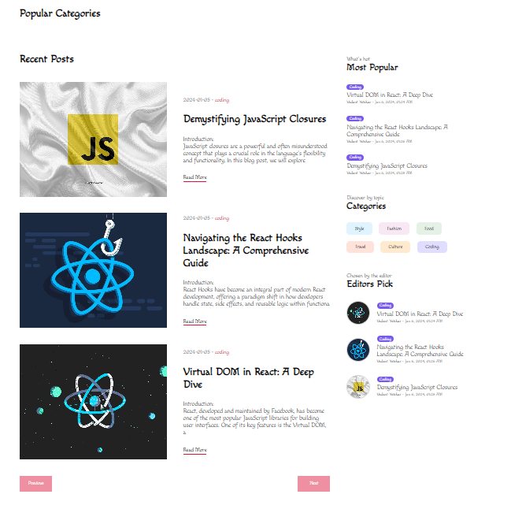
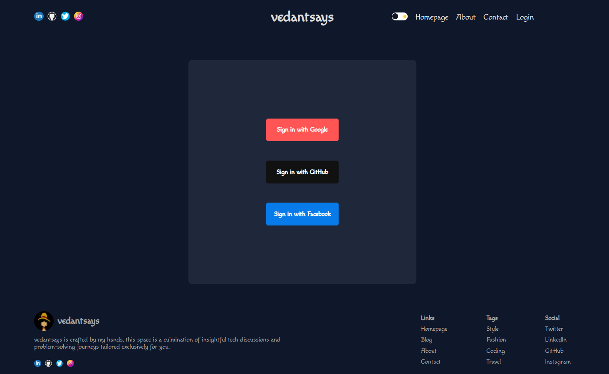
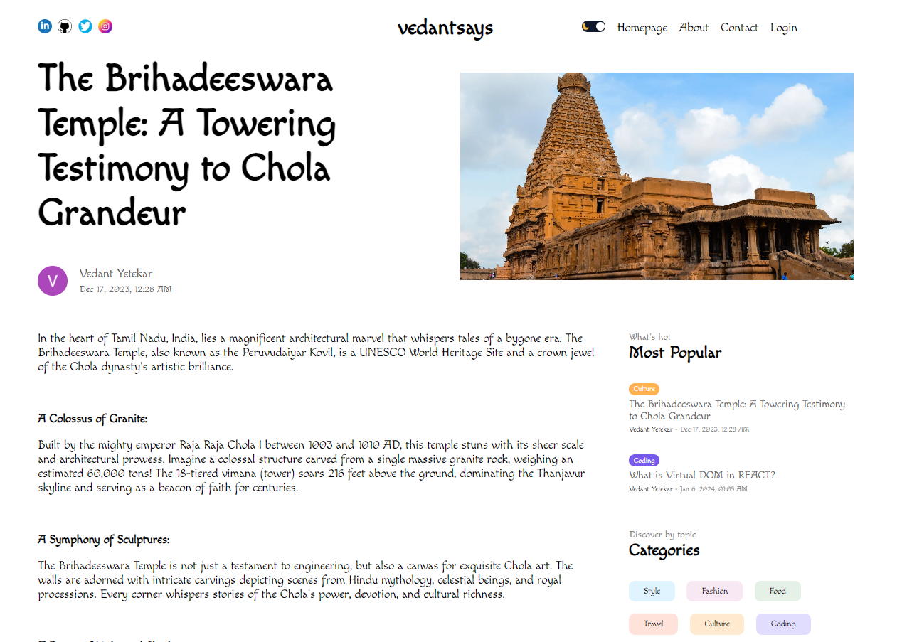
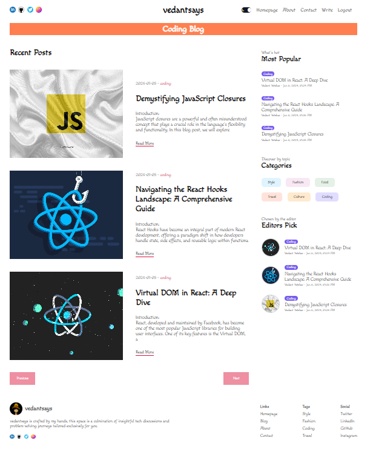
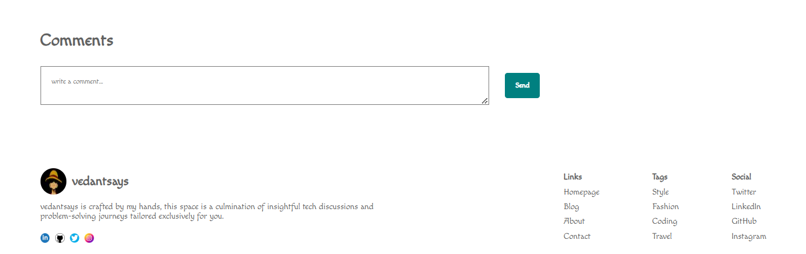

# **vedantsays**

### *Overview*

vedantsays is a blog application built with Next.js, Prisma, MongoDB, and React Quill Editor. It incorporates several key features to provide users with a seamless and engaging blogging experience. Below, you'll find information on technologies used, and an overview of the features.

### *Technologies Used ⚙️*

1. *Next.js*: Utilizes the power of React with the simplicity of Next.js for a seamless and efficient front-end experience.
2. *Prisma*: Employs Prisma as the data access layer for a type-safe database interface and powerful querying capabilities.
3. *MongoDB*: Leverages MongoDB as the database solution for scalable and flexible data storage.
4. *React Quill Editor*: A React component for the Quill rich text editor.
5. *OAuth with NextAuth*: Implements secure OAuth authentication using NextAuth for a seamless and secure login process.

### *Features*

*Dark and Light Mode: Utilizes Context API and useContext hook for seamless switching between dark and light modes.*

*OAuth Authentication: Implements secure authentication using NextAuth, supporting various authentication providers.*

*Pagination: Provides a user-friendly browsing experience with paginated blog posts.*

*Role-Based Authentication: Enhances access control through role-based authentication, ensuring proper authorization.*

*Featured Post Section: Showcases a featured post section on the homepage for spotlighting important content.*

*Genre-Specific Pages: Displays genre-specific pages for users to explore blog posts based on their interests.*

*Popular Posts: Highlights popular posts based on views, enhancing user engagement.*

*Comments Section: For users to express their views on the content.*

